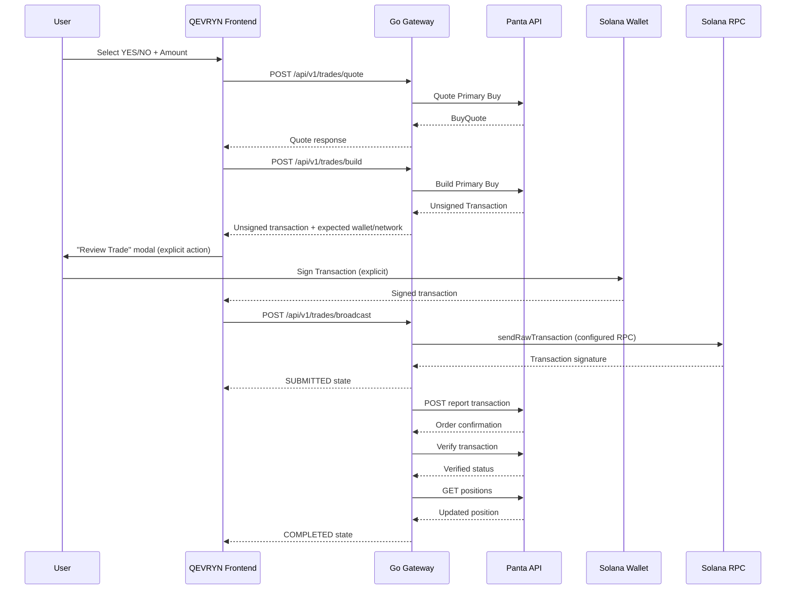

# QEVRYN Trading Flow

## Overview

QEVRYN implements the **Panta primary-buy transaction flow** following the documented Panta custody model.

**Custody model:** QEVRYN never touches private keys. The application builds unsigned transactions via Panta, the user signs with their own wallet, and QEVRYN broadcasts to Solana using its configured RPC.

```
User
 ↓
QEVRYN (Next.js frontend)
 ↓
Panta Quote → Panta Build
 ↓
Unsigned Transaction
 ↓
User Wallet (signs)
 ↓
User Signature
 ↓
Solana RPC (broadcast)
 ↓
Signature
 ↓
Panta Report
 ↓
Panta Verification
 ↓
Position Refresh
```

---

## Sequence Diagram



---

## Endpoints

| Stage | Gateway Endpoint | Description |
|-------|-----------------|-------------|
| Quote | `POST /api/v1/trades/quote` | Read-only quote from Panta |
| Build | `POST /api/v1/trades/build` | Build unsigned transaction |
| Validate | `POST /api/v1/trades/validate` | Validate wallet/network/market/side/amount context before signing |
| Broadcast | `POST /api/v1/trades/broadcast` | Broadcast signed tx via configured RPC |
| Confirm | `POST /api/v1/trades/confirm` | Poll Solana for confirmation |
| Report | `POST /api/v1/trades/report` | Report signature to Panta + verify |
| Complete | `POST /api/v1/trades/complete` | Mark trade completed |
| Status | `GET /api/v1/trades/{id}` | Retrieve trade attempt status |
| Positions | `GET /api/v1/trades/positions/{wallet}` | Refresh positions from Panta |

## Panta API Usage

- **Base URL:** `https://live-api.panta.market/api/v1/` (trailing slash required)
- **Auth:** `X-Api-Key` header (existing adapter authentication, no duplicate implementation)
- **Primary buy amounts:** Human-readable decimal strings
- **Create market amounts:** USDC base units as integer strings

## Trade State Machine

```
IDLE → QUOTING → QUOTE_READY → BUILDING → READY_TO_SIGN → SIGNING
 → SIGNED → BROADCASTING → SUBMITTED → CONFIRMING → CONFIRMED
 → REPORTING → VERIFIED → POSITION_REFRESHING → COMPLETED

Any state may transition to:
 → FAILED, CANCELLED, or UNKNOWN
```

Key distinctions (never collapsed into one message):
- **Submitted** — signature exists, tx sent to RPC
- **Confirmed** — Solana confirms the transaction
- **Verified** — Panta confirms the trade
- **Position refreshed** — authoritative position data retrieved

## Error Categories

| Code | Meaning |
|------|---------|
| `QUOTE_FAILED` | Panta quote request failed |
| `BUILD_FAILED` | Panta build request failed |
| `WALLET_NOT_CONNECTED` | No wallet connected |
| `USER_REJECTED` | User rejected the signature |
| `INVALID_TRANSACTION` | Transaction validation failed |
| `BROADCAST_FAILED` | Solana RPC broadcast failed |
| `CONFIRMATION_TIMEOUT` | Confirmation timed out |
| `TRANSACTION_FAILED` | Transaction failed on-chain |
| `PANTA_REPORT_FAILED` | Panta reporting failed |
| `PANTA_VERIFICATION_FAILED` | Panta verification failed |
| `POSITION_REFRESH_FAILED` | Position retrieval failed |

**Critical:** If the transaction is confirmed on Solana but Panta reporting fails, the user must see: *"Transaction confirmed on Solana. Panta verification is pending."* — not "trade failed."

## Idempotency

- Generated `trade_attempt_id` is the primary idempotency key.
- Never use (amount, market) as an idempotency key — users may legitimately place multiple identical trades.
- `solana_signature` has a unique constraint.
- Lifecycle metadata persisted in `trade_attempts` table.

## Database

`trade_attempts` table fields:
- `id` (UUID, PK)
- `wallet_address`
- `market_id`
- `side` (YES/NO)
- `amount_usdc` (NUMERIC, never float)
- `quote_reference`
- `status` (state machine enum)
- `solana_signature`
- `panta_reference`
- `error_code`, `error_message`
- `created_at`, `updated_at`, `confirmed_at`, `verified_at`

**Never stored:** private keys, seed phrases, signed transaction blobs (unless strictly required).

## Security Controls

- Backend never signs transactions
- Backend never receives private keys/seed phrases
- No automatic wallet signatures — explicit user action required ("Sign & Buy")
- Validation before signing: expected wallet matches connected, network matches, market/side/amount match UI state
- `SOLANA_RPC_URL` from server config — no arbitrary browser-supplied RPCs
- No arbitrary transaction bytes accepted from clients
- No API keys or signed contents logged

## Known Limitations

- Transaction format depends on the exact current Panta API schema (verify against live docs before production)
- Confirmation strategy depends on Solana RPC availability
- Real transaction testing requires manual user action (never automated in CI)

---

## Smoke Test Workflow (Read-Only)

A manual smoke test can verify the trading plumbing **without spending funds**:

1. Start the gateway with `PANTA_API_URL`, `PANTA_API_KEY`, and `SOLANA_RPC_URL` set.
2. Verify `/health` returns `ok`.
3. **Read-only quote:** `POST /api/v1/trades/quote` with a valid market ID, side, amount, and a test wallet public key. This only requests a quote; it does not place any order.
4. Verify the response contains a `quote_reference` and a `trade_attempt_id`.
5. **Optional build:** `POST /api/v1/trades/build` with the quote reference. This returns an unsigned transaction. Do NOT sign unless the developer explicitly chooses to test a real trade.
6. Check `GET /api/v1/trades/{trade_attempt_id}` shows the attempt in `QUOTE_READY` state.

**Real transactions require:**
- explicit manual user action
- showing the amount, market, and side
- the user's explicit wallet signature
- the user's own Solana RPC

Never automate the signature. Never hide the amount, market, or side.

### Deterministic Test Mode

CI tests never touch mainnet. The Go test suite uses:
- httptest servers for the Panta API (quote/build/report/verify/positions)
- deterministic fixtures for Solana transactions (no real RPC)
- an in-memory fake trade service for HTTP-layer tests
