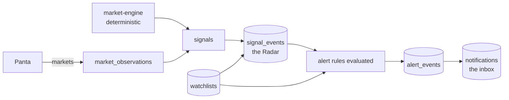
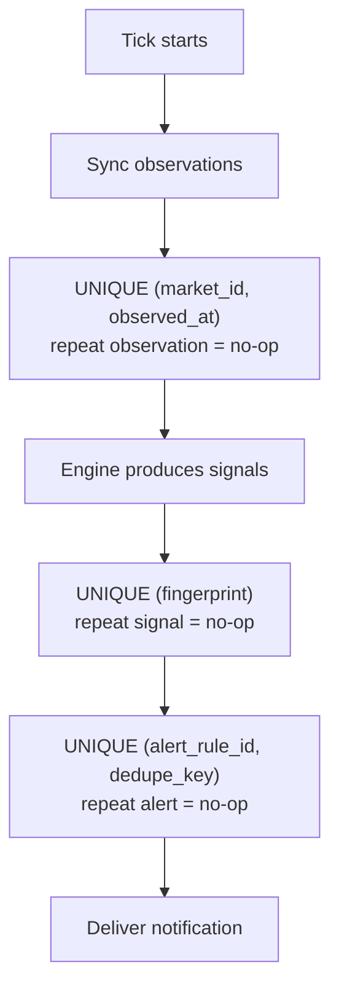

# Watchlists, Signal Radar, Alerts and Notifications

This is the user-owned surface of Qevryn: the part of the platform a person
uses to say *these markets matter to me* and then be told when something
actually happens to them.

It is one pipeline with four products at different points along it:



- A **watchlist** is a named group of markets. It scopes who sees what.
- The **Signal Radar** is the durable event stream: every meaningful change to
  a market becomes one row.
- An **alert rule** says what about those events is worth interrupting someone
  for. Rules are evaluated automatically and deliver in-app notifications.
- The **notification inbox** is where those land, unread and read.

Everything here is deterministic. No language model participates in deciding
whether an alert fires. See
[Design rules](#design-rules-that-are-not-negotiable) for why that matters.

## Data model

Migration `004_watchlists_alerts.sql` creates six tables.

| Table | Holds |
| --- | --- |
| `watchlists` | A named, owned list. Unique per `(user_id, name)`. |
| `watchlist_markets` | Membership. Composite PK, cascades on either side. |
| `signal_events` | The event stream. Fingerprinted, one row per real change. |
| `alert_rules` | A user's criteria. Scoped to a watchlist, a market, or neither. |
| `alert_events` | A rule matched an event. Carries delivery status. |
| `notifications` | The inbox. Unread/read, links back to the alert. |

`signal_events` is a stream, not a queue. Rows are never updated or deleted in
normal operation, they are only appended, and `BIGINT GENERATED ALWAYS AS
IDENTITY` gives them a monotonic ordering that is also safe to paginate on.

### Signal types and severities

Five signal types, each with a fixed set of severities:

| Type | Means |
| --- | --- |
| `NEW_MARKET` | A market appeared in the catalog that we had not indexed. |
| `PROBABILITY_SHIFT` | The YES probability moved. |
| `ACTIVITY_CHANGE` | Volume or trade count moved. |
| `LIQUIDITY_CHANGE` | Liquidity in the market moved. |
| `MARKET_MOVEMENT` | A composite movement signal from the engine. |

Severities run `INFO` < `WATCH` < `SIGNIFICANT` < `CRITICAL`. They are
enforced by `CHECK` constraints in the schema and ranked by `SeverityRank` in
Go. An **unrecognised severity ranks 0**, which sorts below every valid one, so
unknown input can never satisfy a `minimum_severity` filter. That is a
deliberate fail-closed choice: a garbage value silences an alert rather than
escalating one.

## Design rules that are not negotiable

### Idempotency is enforced by the database, not by Go

Three `UNIQUE` constraints are the entire dedupe strategy, and every insert is
`ON CONFLICT DO NOTHING`:



This is what makes a crashed-and-retried tick converge on exactly the state an
uninterrupted tick would have produced. Nothing in the Go code needs to know
whether it has run before. If dedupe lived in application logic, a retry after a
crash between two commits would double-notify every user whose rule matched.

`SignalFingerprint` deliberately **excludes** the database ID and both
timestamps, so re-running detection over the same underlying observation
produces the same fingerprint and is suppressed. It hashes market, signal type,
observation ID, metric and current value, joined with `|` — a character that is
not legal in any component, so distinct tuples cannot collide by concatenation.

### The bridge window deliberately overlaps the previous tick

The worker re-reads a window of signals that *overlaps* the one it processed
last time. That is not an off-by-one bug. The overlap is safe precisely because
the fingerprint makes reprocessing a no-op, and it is what stops a crash
between the sync commit and the alert pass from silently dropping alerts for
those signals forever. Without the overlap, a single unlucky crash loses
notifications with no trace.

### No LLM decides whether an alert fires

`MatchesRule` is a plain predicate over the rule and the event, ordered
cheapest-check-first: enabled, then scope, then per-field equality, then
minimum severity, then numeric thresholds. No scoring, no fuzzy matching, no
model inference. A user can reproduce the outcome by reading their own rule.

`ExplainSignal` is likewise mechanical. Sentences are assembled from the
structured numeric fields that are actually present, and **a nil field is
dropped from the sentence rather than guessed at**. An event with only a current
value says `Current value for this market is 0.61` and stops; it does not imply
a movement it cannot evidence.

### Money and probability use `math/big.Rat`, never `float64`

All monetary and probability arithmetic is exact rational arithmetic, formatted
with `big.Rat.FloatString`. Binary floating point would introduce rounding that
can flip a threshold comparison exactly at the boundary — the case where a user
is most likely to have set a deliberate threshold. Formatting goes through
`FloatString`, which is exact rational rounding with no intermediate binary
step.

### A threshold only applies to the signal type it was defined for

A `probability_change_threshold` is ignored for a liquidity event and vice
versa, which keeps one rule usable across a mixed event stream. When a
threshold *does* apply but the event carries no measurement for it, the rule
does not match: absence of evidence is not evidence of exceeding a threshold.

## Alert evaluation

For each new signal event, `AlertEvaluator.EvaluateEvent` runs:

1. **Fingerprint** the event. Computed here rather than in the repository so the
   value that later feeds `AlertDedupeKey` is byte-identical to the one the
   unique constraint arbitrates on.
2. **Persist** the event. `created=false` means the fingerprint was already
   present — this observation is already in the stream and its alerts already
   exist, so the correct outcome is zero work, not an error and not a
   re-notification. It returns immediately.
3. **Load** enabled rules for the market, and the market's watchlist
   membership set (fetched once per event, not once per rule).
4. **Match** each rule via `MatchesRule`.
5. **Bound the fan-out.** At most `maxAlertsPerEvent` rules are worked through
   per event. The bound is applied at match time and the match that would exceed
   it is not counted, so `Matched` reports what was actually processed.
6. **Cooldown.** A probe looks for `DELIVERED` rows at or after
   `now() - cooldown`. Any row means the user was already told inside the open
   window. The suppression is **not re-scheduled** — the next event for this
   market re-runs the same probe and fires as soon as the window closes.
7. **Dedupe and insert** the `alert_events` row.
8. **Deliver** the notification, then mark the alert `DELIVERED`.
9. On a send failure the alert is marked `FAILED` and evaluation continues. A
   `FAILED` row is not counted by the cooldown probe, so the alert stays
   eligible for retry rather than being silently muted.

A `nil` sender or store is a hard error, not a silent no-op.

## The worker

The worker holds a session-level Postgres advisory lock
`0x50524F5048455445` — the ASCII bytes `QEVRYNE` — for the life of the
process. A second worker exits immediately rather than running.

Two reasons this must not be violated: two pollers would race on observation
timestamps, and they would double-charge the Panta rate limit.

**The key must never change.** `pg_try_advisory_lock` takes a plain `bigint`
with no namespace, so this value shares one lock space with every other advisory
lock in the same database. Rotating it would let an old deployment and a new one
both believe they hold "the" worker lock, which is exactly the race the lock
exists to prevent.

**Note on legacy naming:** The advisory lock key `0x50524F5048455445` (ASCII "QEVRYNE") is a legacy constant. Future versions will use a Qevryn-branded key.

### Failure handling

```
Panta → adapter → markets + observations persisted (intelligence.Syncer)
  → signals persisted
  → signals bridged into signal_events      (AlertEvaluator step 2)
  → alert rules evaluated                  (AlertEvaluator step 3)
  → in-app notifications delivered          (AlertEvaluator steps 5-8)
```

### Configuration

| Variable | Required | Default | Notes |
| --- | --- | --- | --- |
| `DATABASE_URL` | yes | — | The worker exits without it. |
| `MARKET_ENGINE_BIN` | yes | — | Path to the built engine binary. |
| `PANTA_ADAPTER_URL` | no | `http://127.0.0.1:8081` | |
| `QEVRYN_SYNC_INTERVAL_SECONDS` | no | `300` | Clamped to `[30, 86400]`. (Legacy env var name; will be renamed in future) |

`MARKET_ENGINE_BIN` is a hard error when unset rather than a default, and the
startup log states the consequence explicitly. Without the engine the syncer
produces no signals, which means no signal events, which means no alerts ever
fire — the whole monitoring chain would sit there silently appearing healthy. A
monitoring worker that cannot monitor must not pretend to run. The path is also
stat-checked for existence and the executable bit.

### Bounded, with no unbounded queue anywhere

Each tick runs under a hard context deadline (two sync intervals, clamped to
`[1m, 10m]`), so a hung adapter, a hung engine subprocess or a slow database
cannot make a tick run forever. The bridge pass reads at most `maxSignalsPerTick`
(500) signals, newest first; if the window is full the worker logs it, so a
permanently saturated bound is visible rather than silently dropping signals.
Everything held in memory per tick is a slice bounded by a constant. Nothing is
buffered between ticks — whatever does not fit in one window is picked up by a
later tick, and the overlap guarantees progress.

### Single instance, enforced by an advisory lock

The worker holds a session-level Postgres advisory lock
`0x50524F5048455445` — the ASCII bytes `QEVRYNE` — for the life of the
process. A second worker exits immediately rather than running.

Two reasons this must not be violated: two pollers would race on observation
timestamps, and they would double-charge the Panta rate limit.

**The key must never change.** `pg_try_advisory_lock` takes a plain `bigint`
with no namespace, so this value shares one lock space with every other advisory
lock in the same database. Rotating it would let an old deployment and a new one
both believe they hold "the" worker lock, which is exactly the race the lock
exists to prevent.

### Failure handling

A failed tick is logged and retried with exponential backoff (5s base, 5min
cap). After `maxConsecutiveFailures` (5) the worker **does not exit** — it drops
to a 15-minute degraded interval and keeps monitoring. A monitoring worker that
exits stops monitoring, and an outage that begins while the worker is down is
precisely the outage nobody is watching for.

Shutdown drains the in-flight tick for up to 30 seconds.

### Observability

Every log line carries a `request_id` so a tick can be followed end to end, and
a tick emits structured counters: `eventsBridged`, `eventsDedupe`,
`alertsMatched`, `alertsCooldown`, `alertsDedupe`, `notificationsSent`,
`notificationFails`, `evaluationErrors`.

**Never logged**, by policy and not by accident: the Panta API key, any
`Authorization` header, wallet private keys, and raw signed transactions. The
API key is read inside the adapter, the wallet keys and signed transactions live
in the trading package which this binary does not import, and no such value is
ever placed into a log attribute.

## Identity

Every watchlist, alert and notification route is user-owned. Identity is
resolved through the `httpapi.RegisterUserResolver` package-level seam rather
than a resolver passed at mount time, so a deployment installs its provider
once.

`ResolveUser` maps *any* failure to establish an identity — including a
successfully-resolved empty id — to `ErrUnauthenticated`. A misbehaving resolver
therefore cannot degrade into an empty-owner query that would match or expose
someone else's rows.

There is no user field in any request DTO. `CreateRule` and `UpdateRule` are the
two places where the repository takes the owner separately from the rule, and
the adapter writes the resolved identity in before delegating. Identity always
comes from `ResolveUser`, never from the request body, so no request can widen
a write beyond the acting user.

## API

All endpoints are on the gateway under `/api/v1`.

### Watchlists

| Method | Path | Purpose |
| --- | --- | --- |
| `GET` | `/watchlists` | List the caller's watchlists. |
| `POST` | `/watchlists` | Create. `name` is unique per user. |
| `GET` | `/watchlists/{id}` | Fetch one. |
| `PATCH` | `/watchlists/{id}` | Rename or re-describe. |
| `DELETE` | `/watchlists/{id}` | Delete; markets cascade. |
| `POST` | `/watchlists/{id}/markets/{marketId}` | Add a market. |
| `DELETE` | `/watchlists/{id}/markets/{marketId}` | Remove a market. |
| `GET` | `/watchlists/{id}/intelligence` | Aggregate view for the list. |

### Radar

| Method | Path | Purpose |
| --- | --- | --- |
| `GET` | `/intelligence/radar` | The signal stream. |

Supports filtering by market, watchlist, signal type, minimum severity and a
time window, plus **keyset pagination** on `(observed_at DESC, id DESC)`.
Keyset rather than `OFFSET`, because the stream is append-only and being
appended to while you page — an `OFFSET` would skip or repeat rows as new
signals land between requests. The page query and the total-count query share
one filter builder, so the total can never be computed over a different filter
than the page it counts.

### Alert rules

| Method | Path | Purpose |
| --- | --- | --- |
| `GET` | `/alert-rules` | List the caller's rules. |
| `POST` | `/alert-rules` | Create. |
| `GET` | `/alert-rules/events` | Fired alerts, newest first. |
| `GET` | `/alert-rules/{id}` | Fetch one. |
| `PATCH` | `/alert-rules/{id}` | Update, including `enabled`. |
| `DELETE` | `/alert-rules/{id}` | Delete; events cascade. |

A rule is scoped to a `watchlist_id`, a `market_id`, or neither (meaning: every
market the user can see). A `CHECK` constraint enforces that at most one of the
two is set.

### Notifications

| Method | Path | Purpose |
| --- | --- | --- |
| `GET` | `/notifications` | Inbox, newest first. `unreadOnly` filter. |
| `GET` | `/notifications/unread-count` | Badge number. |
| `POST` | `/notifications/read-all` | Mark everything read. |
| `POST` | `/notifications/{id}/read` | Mark one read. |

A partial index on `(user_id, created_at DESC) WHERE read_at IS NULL` keeps the
unread-count query off the full inbox.

## Wiring

`NewHandlerWithEnterprise` mounts all four route groups. Each service is
optional in the same way and for the same reason: **a nil service registers no
routes at all**, rather than mounting handlers that would fail at request time.
That is what lets the gateway start against a database with no trading
credentials.

`NewHandlerWithAllServices` keeps its pre-Task-008 signature and delegates with
the four enterprise services nil, so existing callers and tests are unaffected
and it remains a strict subset of the new constructor.

In `main.go`, the `enterpriseAPI` adapter sits between the repository and the
HTTP interfaces. It lives there on purpose: the repository's method names are
the storage layer's vocabulary, the HTTP surface uses short names, and the two
should not be made to agree by giving the HTTP package a persistence dependency.
Each method is a one-line delegation — no ownership decision, no re-scoping, no
translation — so the ownership filters the repository documents remain the only
place a user id becomes SQL.

The alert evaluator itself is started by the ingestion path, not by the gateway;
the gateway only exposes the user-facing surface.

## Frontend

Next.js route handlers act as a BFF so the browser never holds a gateway
credential: `app/api/watchlists/route.ts` and `app/api/watchlists/[id]/route.ts`
proxy through to the gateway.

| File | Role |
| --- | --- |
| `app/signals/radar-content.tsx` | The Radar. |
| `app/watchlists/watchlists-content.tsx` | List, create, delete. |
| `app/watchlists/[id]/watchlist-detail-content.tsx` | Per-list detail and intelligence. |
| `components/notification-center.tsx` | Inbox, mounted in the topbar. |
| `lib/enterprise-api.ts` | Gateway client. |
| `lib/enterprise-utils.ts` | Formatting helpers. |
| `lib/api-types.ts` | Shared response types. |

A `Failed to fetch watchlists: fetch failed` line during `npm run build` is
**expected**. The gateway is not running during a static prerender; the build
still exits 0.

## Running it

```bash
make worker-build   # compile the worker and the engine it shells out to
make worker         # run it in the foreground
```

The worker needs `DATABASE_URL` and `MARKET_ENGINE_BIN` in the environment.
See `.env.example`.

## Testing

The deterministic logic in `alertlogic.go` is unit-tested directly
(`alertlogic_test.go`) with no database and no network: fingerprint determinism
and distinctness, explanation that never invents values, rule validation
boundaries, and dedupe-key variation.

The rules these tests encode are worth keeping in mind when changing any of the
above: if you make a threshold comparison use `float64`, drop a field from a
fingerprint, move dedupe out of the database, or let a model decide a match, the
existing tests are what will notice.

